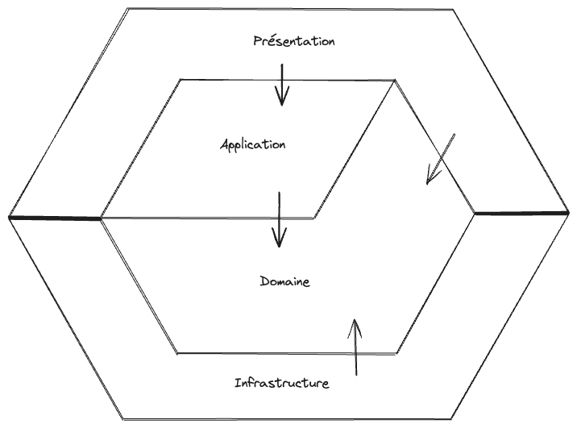
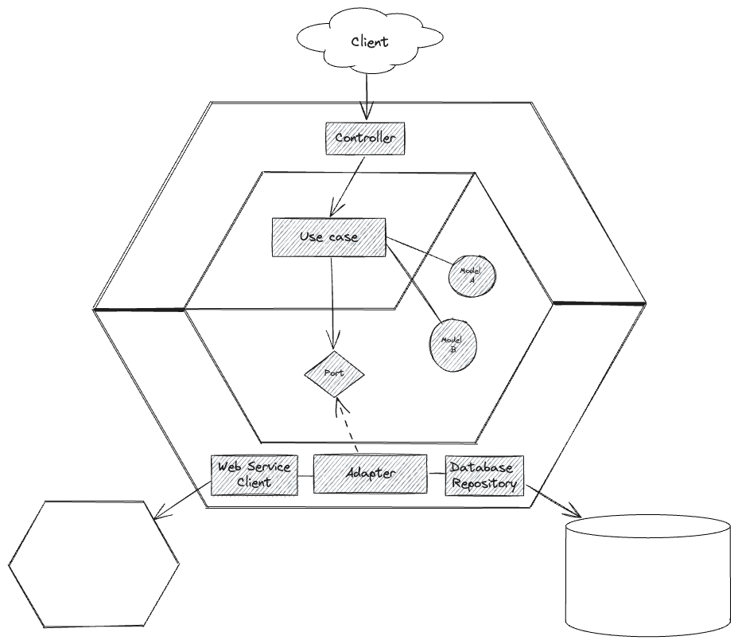

Ce petit projet a pour but de présenter un type d'architecture hexagonale, aussi appelée architecture en oignon, dans le cadre d'une API Web, au travers d'un cas d'utilisation très simple qui met en avant la pertinence de ce type d'architecture.

* [ ] Destinataire
* [ ] POJO/Programmation objet
* [ ] Port/Adapter

# Les couches

## TLDR

* Domaine = modèle métier
* Application = logique applicative
* Présentation = exposition
* Infrastructure = accès aux partenaires

## Explication

### Présentation

Cette couche contient tout ce qui impacte l'exposition de l'API : la déclaration des controllers, de l'authentification, le format des entrées-sorties, etc.

Par exemple, c'est ici que l'on va définir notre contrat d'interface au format OpenAPI, les points d'entrée, le modèle d'entrées-sorties (que l'on peut appeler Requests/Responses, Resources, Inputs/Outputs, etc.)

### Application

La couche Application contient la logique applicative, c'est-à-dire les cas d'utilisation fonctionnels. La couche Domaine contient la définition des entités métier, la couche Application agrège ces entités.

Prenons l'exemple de la création d'un compte utilisateur. La classe Utilisateur est définie dans le domaine. Cette entité n'a connaissance que de ses propriétés : nom, prénom, adresse, numéro de téléphone. Si je veux, par exemple, appliquer une règle métier sur le format du numéro de téléphone, je peux le faire directement dans la classe Utilisateur.

En revanche, si je veux vérifier que le nom de l'utilisateur n'est pas déjà pris par un autre, je dois avoir connaissance de tous les utilisateurs. C'est dans la couche Application que je vais récupérer la liste des utilisateurs existants - via un *port* - pour vérifier que le nom de celui que je veux enregistrer n'est pas déjà utilisé.

Ce cas d'utilisation peut s'appeler "Créer un compte utilisateur", la fonction `createUserAccount` et l'une des règles à implémenter : vérifier que le nom d'utilisateur n'est pas déjà pris.

### Domaine

Cette couche est centrale. Elle contient le modèle fonctionnel du domaine de l'application. Lorsqu'on réfléchit à ce modèle, on se soucie uniquement de son aspect métier, pas des problématiques liées aux partenaires ni de la manière dont on expose notre API.

La couche Domaine contient aussi la définition des *ports* implémentés dans les *adapters* de la couche Infrastructure. Comme pour le modèle, la définition des *ports* ne doit pas contenir de notion de partenaire ou technique, elle contient uniquement les notions fonctionnelles du domaine.

### Infrastructure

Cette couche contient l'accès aux *partenaires*, qu'ils soient une base de données, un service Web, etc.

Les couches Application et Domaine manipulent des notions fonctionnelles ou métier. La couche Infrastructure utilise les technologies qui permettent d'accéder aux données qu'il y a derrière ces notions fonctionnelles.

L'un des intérêts de cette couche est de pouvoir changer de partenaire (par exemple un service SOAP pour une API, une base de données MySQL pour un MongoDB) sans impacter la logique applicative.

Il est important de bien comprendre les interdépendances de ces quatre couches pour mieux saisir l'intérêt de cette répartition.

# Les dépendances

Les flèches sont importantes :

* La couche **Présentation** a connaissance de la couche **Application**
* La couche **Application** a connaissance de la couche **Domaine**
* La couche **Infrastructure** a connaissance de la couche **Domaine**

Cela implique que la couche Présentation a connaissance de la couche Domaine par transitivité, mais surtout que **la couche Domaine n'a connaissance d'aucune autre couche**.

Cela signifie que la couche Domaine ne peut pas manipuler ce qui est déclaré dans l'une des autres couches. En revanche, **toutes les couches peuvent manipuler ce qui est déclaré dans le domaine**.

On peut aussi en déduire que les couches Présentation et Infrastructure n'ont pas connaissance l'une de l'autre. Mais dans ce cas, comment fait-on pour rapatrier une donnée d'un partenaire, la faire transiter par notre domaine et la renvoyer à l'un des clients de notre API ? Réponse : la magie Spring Boot (retrouver le nom du modèle qu'il y a derrière).

Rappel : les ports déclarés dans le domaine sont des interfaces (génériques et fonctionnelles) implémentées (de manière spécifique aux technologies) dans l'infrastructure.

Dans l'ordre :

1. Le controller (Présentation) reçoit une requête, il appelle un cas d'utilisation (Application)
2. Le cas d'utilisation appelle une fonction déclarée dans un port (Domaine)
3. Spring Boot sait qu'il doit exécuter le code de l'adapter (Infrastructure) qui implémente ce port
4. La donnée fait ensuite le chemin inverse

# Questions fréquemment posées

> Pourquoi une forme d'hexagone ?

Cela fait référence aux alvéoles des abeilles, car il est possible, comme dans une ruche, de les imbriquer.

> Quelle est la différence entre architecture hexagonale et architecture en oignon ?

La couche Application. L'architecture en oignon est une évolution de l'architecture hexagonale qui ne contient pas de couche intermédiaire entre la couche Présentation et la couche Domaine.

# Références

* https://blog.ippon.fr/2023/01/16/cucumber-junit5-avec-spring/
* https://apero-tech.fr/configurer-cucumber-spring-boot-junit-5/
* https://codersee.com/generate-kotlin-client-from-openapi-specs/
* https://dev.to/bjornvdlaan/create-your-rest-api-using-openapi-kotlin-spring-generator-5154
