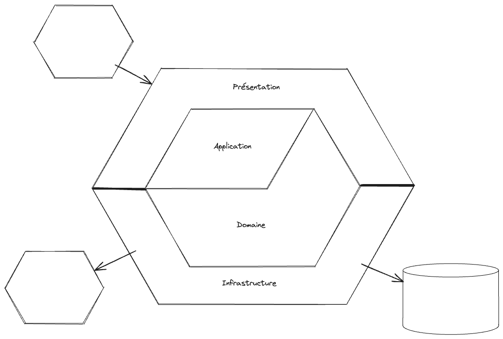

Ce petit projet a pour but de présenter un type d'architecture hexagonale, appelée architecture "en oignon", dans le cadre d'une API Web, au travers d'un cas d'utilisation très simple qui met en avant la pertinence de ce type d'architecture.

* [ ] Destinataire
* [ ] POJO/Programmation objet
* [ ] Port/Adapter

# Les couches

## TLDR;

* Domaine = modèle métier
* Application = logique applicative
* Présentation = exposition
* Infrastructure = accès aux partenaires

## Explication

### Domaine

Cette couche est centrale. Elle contient le modèle fonctionnel du domaine de l'application. Lorsqu'on réfléchit à ce modèle, on se soucie uniquement de son aspect métier, pas des problématiques liées aux partenaires ni de la manière dont on expose notre API.

La couche Domaine contient aussi la définition des *ports* implémentés dans les *adapters* de la couche Infrastructure. Comme pour le modèle, la définition des *ports* ne doit pas contenir de notion technique, elle contient uniquement les notions fonctionnelles du domaine.

### Application

La couche Application contient la logique applicative, c'est-à-dire les cas d'utilisation fonctionnels. Le domaine contient la définition des entités métier, la couche Application agrège ces entités.

Prenons l'exemple de la création d'un compte utilisateur. L'entité Utilisateur est définie dans le domaine. Cette entité n'a connaissance que de ses propriétés : nom, prénom, adresse, numéro de téléphone. Si je veux, par exemple, appliquer une règle métier sur le format du numéro de téléphone, je peux le faire dans l'entité Utilisateur, c'est-à-dire dans le domaine.

En revanche, si je veux vérifier que le nom de l'utilisateur n'est pas déjà pris par un autre, je dois avoir connaissance de tous les utilisateurs. C'est dans la couche Application que je vais récupérer la liste des utilisateurs existants - via un *port* - pour vérifier que le nom de celui que je veux enregistrer n'est pas déjà utilisé.

Ce cas d'utilisation peut s'appeler "Créer un compte utilisateur", la fonction `createUserAccount` et l'une des règles à implémenter : vérifier que le nom d'utilisateur n'est pas déjà pris.

### Présentation

Cette couche, aussi appelée "Exposition", contient la définition de l'API et le contrôle des entrées-sorties.

Problématiques d'accès aux ressources
structure, format

### Infrastructure

# Les dépendances

# Questions fréquemment posées

> Pourquoi une forme d'hexagone ?

Cela fait référence aux alvéoles des abeilles car, comme dans une ruche, il est possible de les imbriquer.

> Quelle est la différence entre architecture hexagonale et architecture en oignon ?

Réponse : la couche Application. L'architecture en oignon est une évolution de l'architecture hexagonale qui, elle, ne contient pas de couche intermédiaire entre la couche Présentation et la couche Domaine.

# Références

* https://blog.ippon.fr/2023/01/16/cucumber-junit5-avec-spring/
* https://apero-tech.fr/configurer-cucumber-spring-boot-junit-5/
* https://codersee.com/generate-kotlin-client-from-openapi-specs/
* https://dev.to/bjornvdlaan/create-your-rest-api-using-openapi-kotlin-spring-generator-5154
